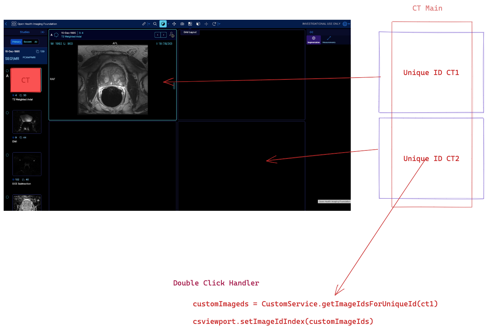
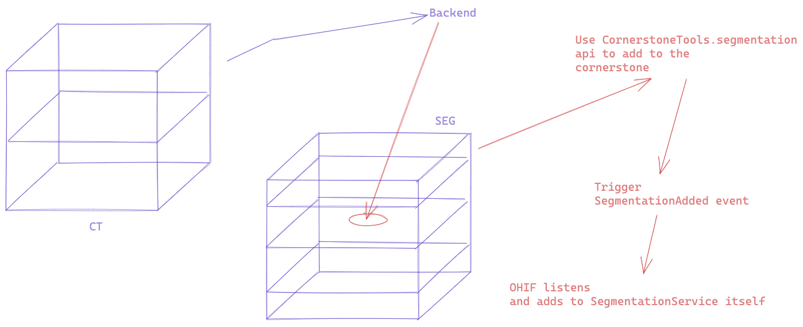

# OHIF Office Hours Notes 2023-01-26

---

## Q & A

### If I want to split a displaySet into separate portions and show them inside the study panel, how can I do that?

A: create your own thumbnail panel study browser. May need a custom study browser to handle double click and the drag and drop. Perhaps in HP service or custom service, to get image ids for unique (display set/thumbnail) id and then go to cornerstone viewport and set the image id index

---

### Chest CT nodules, each nodule spans multiple slices, and each nodule has a separate labelmap.

A: We already have support to show polyData actors in cornerstone viewport (https://www.cornerstonejs.org/live-examples/polydataactormanipulationtools) you can use marching cubes from vtk.js to generate closed surfaces and render them in out volume_3d viewport

https://kitware.github.io/vtk-js/examples/VolumeContour.html

---

### What does segmentation data look like in OHIF.

A: OHIF reads DICOM seg (modality) There is a limitation that segmentations cannot overlap. If there are overlaps, create separate segmentations making them mutually exclusive.OHIF shows warning when segments overlap. We are looking into solving the overlap problem. Segments within the SAME segmentation cannot overlap.

Perhaps encode the segmentations as binary RLE??? for performance improvement over DICOM.

Create segmentation using createAndCacheDerivedVolume right after sending the request for one slice. When the backend responds, insert data in 3D segmentation volume. This makes the data ready for the service in the cornerstone cache. Look at segmentation rendering example in cornerstone: https://www.cornerstonejs.org/live-examples/segmentationrendering. OHIF is listening to CS seg events, and adds it to the segmentation service.

If using DICOM use makeDisplaySets and the rest is handled by OHIF - might need to add the display set.
